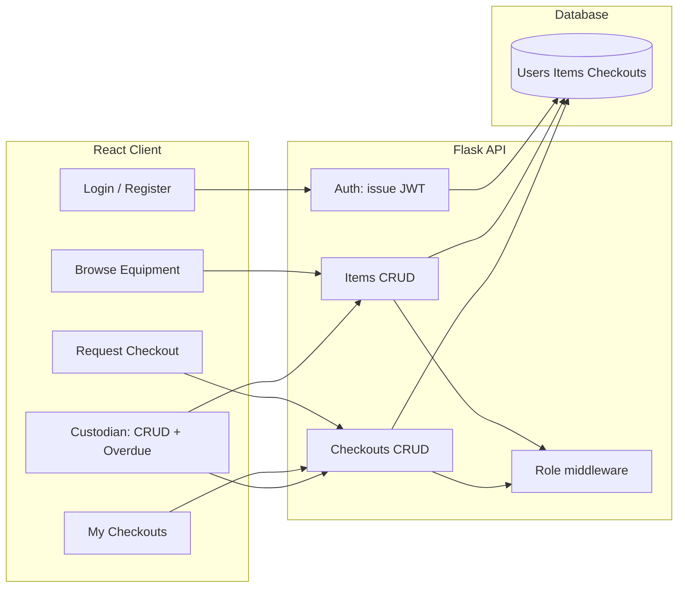

# Project 3 Pitch: GearLedger — Shared Equipment Checkout for Small Teams

## Part 1: Business Problem Scenario

**Who is the user?**  
Coaches, club officers, and lab leads at a **high school or community organization** (robotics team, theater props, outdoor club, or school makerspace). Members are students or volunteers; a few trusted people act as **custodians** who own the inventory list.

**What is their goal or need?**  
They need one place to **see what gear exists**, **who has it**, and **when it is due back**, without relying on group chats, paper sign-out sheets, or a shared spreadsheet that everyone edits.

**Why is this need important?**  
When checkout is informal, items go missing, the same ladder or camera gets promised to two people, and renewals for **insurance or safety inspections** are forgotten. That wastes money, creates conflict, and can create real safety or liability issues for the organization.

**How will the app solve this need?**  
**GearLedger** will be a small web app where **signed-in members** can browse equipment, request or check out items (with due dates), and mark returns. **Custodian accounts** can add/edit gear, approve or adjust checkouts, and see an **overdue** view. Everything is tied to **accounts and roles**, so only the right people can change inventory or close a loan.

---

## Part 2: Problem-Solving Process

### Development stages

1. **Define data models and relationships**  
   Entities such as `User`, `EquipmentItem`, `Checkout` (or `Loan`), and optional `Category` / `MaintenanceNote`. Clear rules: who can create items, who “owns” an open checkout, and how returns update state.

2. **Scaffold Flask API with protected routes**  
   REST-style routes for items and checkouts; consistent JSON responses and HTTP status codes; environment-based config for database URL and secrets.

3. **Implement authentication**  
   **JWT** (access tokens in `Authorization: Bearer`, stored in memory or `sessionStorage` on the client) with hashed passwords (e.g. Werkzeug or bcrypt). Refresh or short-lived tokens if time allows; at minimum, login returns a JWT and protected routes verify it.

4. **Build React UI**  
   Login/register, equipment list/detail, checkout request form, “my checkouts,” and custodian views (inventory CRUD, overdue list). Use `fetch` or Axios with the JWT attached.

5. **Route protection and conditional rendering**  
   React Router guards for authenticated routes; hide custodian actions unless `role === 'custodian'` (or similar). Backend must **never** trust the UI alone—enforce role checks on every sensitive endpoint.

6. **Test CRUD and auth**  
   Manual test matrix: register, login, wrong password, access protected API without token, member vs custodian actions, checkout lifecycle (open → returned), edge cases (double checkout of unique items if applicable).

7. **UI polish and error handling**  
   Loading and empty states, validation messages, accessible forms, simple responsive layout; generic error handling for network and 401/403.

### Conceptual plan (diagram)

### Anticipated challenges

- **Ownership and authorization bugs** — ensuring members cannot close or reassign another user’s checkout without custodian rights.
- **Concurrency** — two people requesting the last “single quantity” item; handle with clear business rules (first-approved wins or waitlist—scope to one simple rule).
- **JWT expiry and logout** — client must handle 401 and redirect to login; optional refresh flow if time permits.
- **Deployment** — CORS, HTTPS, and secure `SECRET_KEY` / DB credentials in production.

### Authentication method

**JWT** — stateless API fits a **decoupled React + Flask** setup, easy to test with tools like Postman, and matches common “SPA + REST” patterns taught in full-stack courses.

### Tools and libraries (planned)

| Area | Choice |
|------|--------|
| Backend | Python **Flask**, **Flask-SQLAlchemy** (or SQLAlchemy + migrations if required) |
| Auth | **Flask-JWT-Extended** (or PyJWT + manual guard), password hashing via Werkzeug/bcrypt |
| DB | **SQLite** for dev; **PostgreSQL** on deploy if required |
| Frontend | **React**, **React Router**, `fetch` or **Axios** |
| Optional | **python-dotenv**, simple CORS setup for local dev |

### Why this architecture fits the project

Flask keeps the **API small and explicit** (good for grading and debugging). React separates **UI concerns** from **auth and data**. JWT makes **protected routes** and **role checks** easy to demonstrate on both client and server. The domain naturally requires **CRUD**, **multi-user state**, and **clear authorization**, which aligns with the course’s full-stack + auth requirements.

---

## Part 3: Timeline and Scope

### Time estimates by activity

| Activity | Estimated time |
|----------|----------------|
| Business problem identification | 0.5 day |
| Project planning (models, routes, wireframes) | 1–1.5 days |
| Database and model design | 1 day |
| UI planning / wireframing | 1 day |
| Backend implementation and auth | 3–4 days |
| Frontend structure and fetches | 3–4 days |
| UI polish and error handling | 2 days |
| Reflection and video creation | 1 day |

### Week-by-week plan

**Week 1**

- **Days 1–2:** Finalize problem statement, user roles, and entity relationships; sketch low-fidelity wireframes for login, catalog, checkout, and custodian screens; set up Flask + React repos or monorepo structure.
- **Days 3–4:** Implement SQLAlchemy models and migrations; seed script for sample equipment (optional); basic item and user endpoints.
- **Days 5–7:** Register/login, password hashing, JWT issuance and verification; protect item/checkout routes; **Project Critique:** share ERD + route list + wireframes for feedback.

**Week 2**

- **Days 1–3:** React app shell, auth context, protected routes; equipment list/detail; checkout create and “my checkouts.”
- **Days 4–5:** Custodian CRUD for items; overdue query endpoint; role checks on server and conditional UI.
- **Days 6–7:** **Iterate from critique** (adjust flows or fields if needed); manual testing pass; fix auth and ownership bugs.

**Week 3 (buffer / finalize)**

- **Days 1–2:** Loading/error states, form validation, responsive layout; CORS and env docs for local run.
- **Day 3:** Deploy or document deploy steps if required; final regression on CRUD + auth.
- **Days 4–5:** Write reflection; record demo video; final submission checklist.

### Feedback, iteration, and testing

- **Seek feedback (Project Critique):** End of Week 1 after models + auth skeleton and wireframes exist.
- **Iterate:** Week 2, mid-week, after critique notes; second pass before final polish if instructor or peers flag gaps.
- **Debug, test, finalize:** Dedicated blocks in Week 2 (days 6–7) and Week 3 (days 1–3); focus on 401/403, role bypass attempts, and checkout state transitions.

### Research / review topics

- **Flask-JWT-Extended** (or course-preferred JWT library): token lifetime, `@jwt_required()`, custom claims for role.
- **React Router v6** protected routes and redirect-on-401 pattern.
- **SQLAlchemy** relationships (User ↔ Checkout ↔ EquipmentItem) and cascade rules.
- **Deployment:** hosting options (e.g. Render, Railway, or course platform), environment variables, and HTTPS basics.

---

*End of pitch — export this file to PDF for submission if your course requires PDF.*
